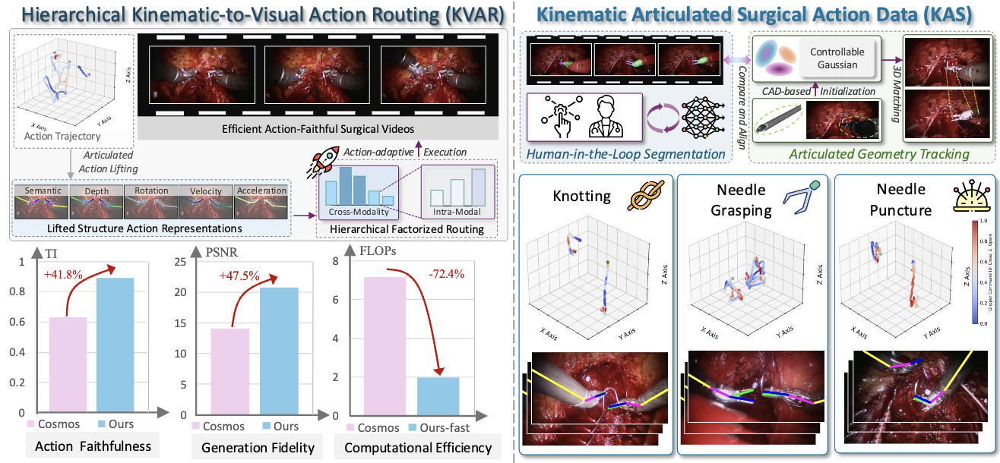
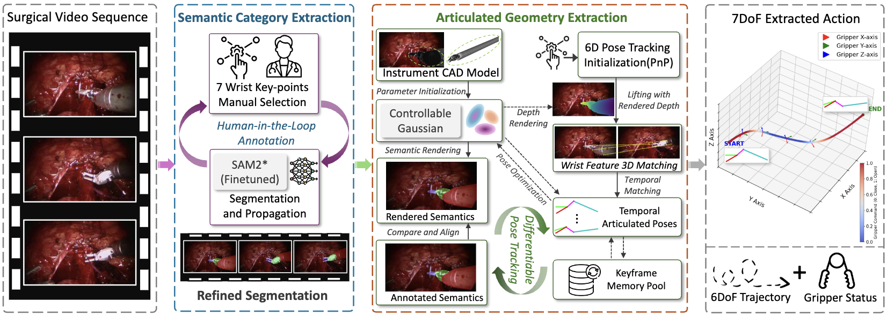
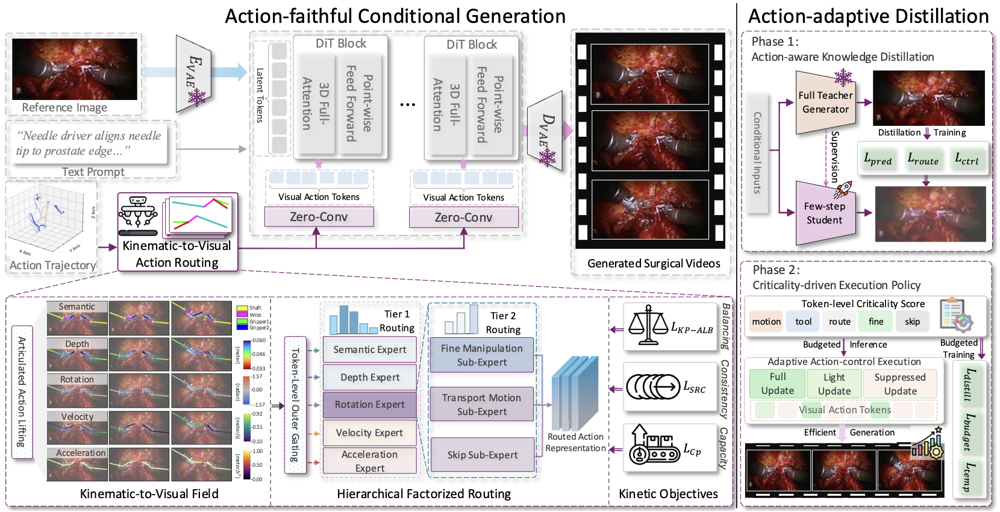

# KVLR [NeurIPS 2026]

**From Articulated Kinematics to Routed Visual Control for Action-Conditioned Surgical Video Generation**

Accepted at **NeurIPS 2026**.

[Project Page](https://arlo0o.github.io/KVLR-project/) | [Paper](https://arxiv.org/abs/2605.08712) | [Video](https://arlo0o.github.io/KVLR-project/#demo) | [Citation](#citation)

Bohan Li, Shuojue Yang, Baorui Peng, Xianda Guo, Erli Zhang, Youqi Tao, Junfeng Duan, Daguang Xu, Qi Dou, Xin Jin, Wenjun Zeng, Hao Zhao, Yueming Jin.

This repository contains the KVLR implementation.
It includes KVLR teacher training/inference, KVLR-fast student distillation, efficiency profiling,
and metric evaluation code.



## Resources

- Checkpoints: https://drive.google.com/drive/folders/1KRLFxWvjmfTTtImigWUMKXWAU6mhX1o5?usp=sharing
- KASA data: https://drive.google.com/drive/folders/14vHj7IB-pA09QhrYT7D06Ei6A6md3z8k?usp=sharing

The data folder on Google Drive contains:

- `annotations.zip`: captions, action annotations, split/task CSV files, and action utility files.
- `knotting.zip`: KASA videos for the knotting subset.
- `needleGrasping.zip`: KASA videos for the needle-grasping subset.
- `needlePuncture.zip`: KASA videos for the needle-puncture subset.

After downloading, a convenient local layout is:

```text
<repo-root>/
  KVLR/
  checkpoints/
    base/
      hunyuan_vae.safetensors
      google/t5-v1_1-xxl/
      openai/clip-vit-large-patch14/
    stage1_i2v/
    stage2_i2v/
    kvlr/merged_model.safetensors
    kvlr_fast/merged_model.safetensors
    metrics/
  data/kasa/
    annotations/
    frames/
    videos/
      knotting/
      needleGrasping/
      needlePuncture/
```

One possible extraction workflow is:

```bash
mkdir -p data/kasa/annotations data/kasa/videos
unzip /path/to/annotations.zip -d data/kasa/annotations
unzip /path/to/knotting.zip -d data/kasa/videos
unzip /path/to/needleGrasping.zip -d data/kasa/videos
unzip /path/to/needlePuncture.zip -d data/kasa/videos
```

If an archive already contains its top-level action folder, keep that structure. The expected video
paths are `data/kasa/videos/knotting/`, `data/kasa/videos/needleGrasping/`, and
`data/kasa/videos/needlePuncture/`. If first-frame images are not included separately, they can be
generated from the videos into `data/kasa/frames/{action}/{video_id}/frame_000000.png`.
The data-preparation script also accepts archives that unpack one additional nested action folder,
for example `data/kasa/videos/knotting/knotting/`.

Set these variables if you use a different layout:

```bash
export KASA_DATA_ROOT=/path/to/kasa
export KASA_ANNOTATION_ROOT=$KASA_DATA_ROOT/annotations
export KASA_ACTION_ROOT=$KASA_DATA_ROOT/annotations/label_results
export KASA_FRAMES_ROOT=$KASA_DATA_ROOT/frames
export KASA_VIDEO_ROOT=$KASA_DATA_ROOT/videos
export KVLR_CKPT_ROOT=/path/to/base/checkpoints
```

## Environment

The code is intended for Linux with NVIDIA GPUs, CUDA, PyTorch, and Python >= 3.10.

```bash
# Run from <repo-root>, the directory containing setup.py and requirements.txt.
python -m venv .venv
source .venv/bin/activate
pip install --upgrade pip
pip install -r requirements.txt
pip install -e .
```

Some training runs require `torchrun` multi-GPU execution and ColossalAI support. For offline metric
evaluation, place the I3D, AlexNet, and Inception weights under `checkpoints/metrics/` or pass their
paths explicitly to `scripts/evaluate_video_metrics.py`.

## Data Preparation



If you need to rebuild the KVLR-style CSV from KASA captions:

```bash
python scripts/prepare_surgical_dataset.py \
  --resolution 768px \
  --video-root "$KASA_VIDEO_ROOT" \
  --frames-root "$KASA_FRAMES_ROOT" \
  --annotations-root "$KASA_ANNOTATION_ROOT" \
  --output-csv "$KASA_ANNOTATION_ROOT/surgical_rarp.csv"
```

To sample a validation/task CSV for inference:

```bash
python scripts/make_csv.py \
  --input "$KASA_ANNOTATION_ROOT/surgical_rarp.csv" \
  --output "$KASA_ANNOTATION_ROOT/inference_tasks_val_set.csv" \
  --ratio 0.15 \
  --seed 42
```

## Training



Stage 2 I2V adaptation:

```bash
KASA_TRAIN_CSV="$KASA_ANNOTATION_ROOT/surgical_rarp.csv" \
STAGE1_CHECKPOINT=./checkpoints/stage1_i2v \
NPROC_PER_NODE=8 \
bash scripts/train_stage2_i2v.sh
```

Stage 3 action routing fine-tuning:

```bash
KASA_ACTION_CSV="$KASA_ANNOTATION_ROOT/surgical_rarp_action_filtered.csv" \
STAGE2_CHECKPOINT=./checkpoints/stage2_i2v \
KASA_ACTION_ROOT="$KASA_ACTION_ROOT" \
NPROC_PER_NODE=8 \
bash scripts/train_stage3_action.sh
```

KVLR-fast student distillation:

```bash
TRAIN_STAGE=4step_budgeted \
KASA_ACTION_CSV="$KASA_ANNOTATION_ROOT/surgical_rarp_action_filtered.csv" \
STUDENT_INIT_WEIGHTS=./checkpoints/stage2_i2v \
TEACHER_CKPT=./checkpoints/kvlr/merged_model.safetensors \
NPROC_PER_NODE=8 \
bash scripts/train_student_distill.sh
```

## Inference

```bash
bash scripts/batch_inference_action.sh \
  --tasks "$KASA_ANNOTATION_ROOT/inference_tasks_val_set.csv" \
  --checkpoint ./checkpoints/kvlr/merged_model.safetensors \
  --outputs ./outputs/inference/kvlr \
  --nproc-per-node 4
```

`configs/inference_tasks_example.csv` shows the expected CSV schema.

KVLR-fast student inference uses the same task CSV:

```bash
bash scripts/batch_inference_student.sh \
  --tasks "$KASA_ANNOTATION_ROOT/inference_tasks_val_set.csv" \
  --checkpoint ./checkpoints/kvlr_fast/merged_model.safetensors \
  --outputs ./outputs/inference/kvlr_fast \
  --nproc-per-node 4
```

## Efficiency Profiling

```bash
TASKS_CSV="$KASA_ANNOTATION_ROOT/inference_tasks_val_set.csv" \
TEACHER_CHECKPOINT=./checkpoints/kvlr/merged_model.safetensors \
STUDENT_CHECKPOINT=./checkpoints/kvlr_fast/merged_model.safetensors \
bash scripts/profile_efficiency_compare.sh
```

The script writes per-model wall-clock profiles and a summary JSON under
`outputs/efficiency_profile/`.

## Evaluation

```bash
python scripts/evaluate_video_metrics.py \
  --pred_dir ./outputs/inference/kvlr \
  --gt_dir "$KASA_VIDEO_ROOT" \
  --output_json ./outputs/metrics_kvlr.json \
  --i3d_model_path ./checkpoints/metrics/i3d_torchscript.pt
```

## Package Notes

- `KVLR/models/action_encoder.py` implements the Kinematic-to-Visual Action Field and hierarchical routing modules.
- `KVLR/models/adaptive_exec/` implements criticality-driven conditional execution for KVLR-fast.
- `KVLR/losses/` contains the routing, control, budget, and temporal distillation losses.
- Generated outputs, downloaded data, checkpoints, caches, and local logs are intentionally excluded by `.supplementignore`.

Local cluster paths, cache files, and one-off backup scripts are not required for reproduction.

## Citation

If you use KVLR in your research, please cite the paper:

```bibtex
@article{li2026articulated,
  title={From Articulated Kinematics to Routed Visual Control for Action-Conditioned Surgical Video Generation},
  author={Li, Bohan and Yang, Shuojue and Peng, Baorui and Guo, Xianda and Zhang, Erli and Tao, Youqi and Duan, Junfeng and Xu, Daguang and Dou, Qi and Jin, Xin and others},
  journal={arXiv preprint arXiv:2605.08712},
  year={2026}
}
```
